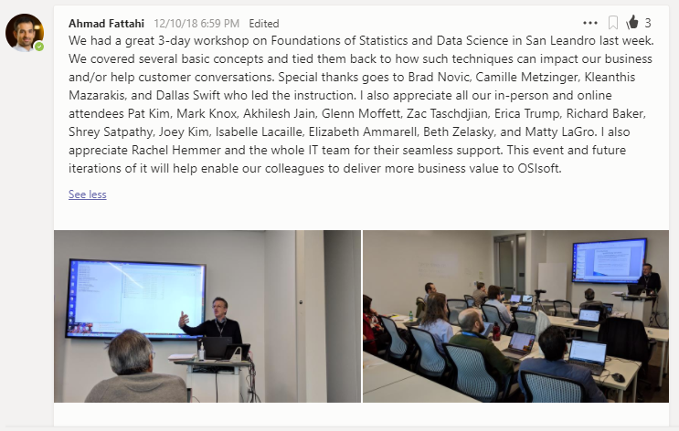

# 2018 Data Science Workshop 

* [Details in Teams](https://teams.microsoft.com/l/message/19:16f0093e73a04d0c87089820126cc437@thread.skype/1544486369277?tenantId=a445ee81-2b91-4806-883b-1dc673d59147&groupId=6be112fe-4ead-4ceb-822c-e7e82a003e7a&parentMessageId=1544486369277&teamName=Data%20%40%20OSIsoft&channelName=General&createdTime=1544486369277)
* [Workshop Slides (PDF)](OSIsoft%20Statistics%20Workshop%20final.pdf)
* [Setup intructions if executing the notebooks outside of JupyterHub](Fundamentals%20of%20Statistics%20and%20Data%20Science%20Workshop%20Prerequisites.pdf)

## Python notebooks

* [class-fill-in-workbook-python-exercises.ipynb](Python/class-fill-in-workbook-python-exercises.ipynb)
* [class-solutions-python-exercises.ipynb](Python/class-solutions-python-exercises.ipynb)
* [class-solutions-python-lab1.ipynb](Python/class-solutions-python-lab1.ipynb)
* [class-solutions-python-lab2.ipynb](Python/class-solutions-python-lab2.ipynb) 
* [class-solutions-python-lab3.ipynb](Python/class-solutions-python-lab3.ipynb)

## R notebooks

* [class-fill-in-workbook-r-exercises.ipynb](R/class-fill-in-workbook-r-exercises.ipynb)
* [class-solutions-R-exercises.ipynb](R/class-solutions-R-exercises.ipynb)
* [class-solutions-R-lab1.ipynb](R/class-solutions-R-lab1.ipynb)
* [class-solutions-R-lab2.ipynb](R/class-solutions-R-lab2.ipynb)
* [class-solutions-R-lab3.ipynb](R/class-solutions-R-lab3.ipynb)

## Datasets 

* [Elongation.xlsx](Datasets/Elongation.xlsx)
* [Friction.xlsx](Datasets/Friction.xlsx)
* [MachineTol.xlsx](Datasets/MachineTol.xlsx)
* [MachTol.xlsx](Datasets/MachTol.xlsx)
* [Tanks](Datasets/Tanks)
* [Thickness.xlsx](Datasets/Thickness.xlsx)
* [Tolerance](Datasets/Tolerance)
* [VAV_3-06_4-06_Stacked.xlsx](Datasets/VAV_3-06_4-06_Stacked.xlsx)
* [VAV_3-06_4-06.xlsx](Datasets/VAV_3-06_4-06.xlsx)
* [VAV_EventFrames_Stats_Class.xlsx](Datasets/VAV_EventFrames_Stats_Class.xlsx)
* [Weights.xlsx](Datasets/Weights.xlsx)
* [Welding.xlsx](Datasets/Welding.xlsx)

